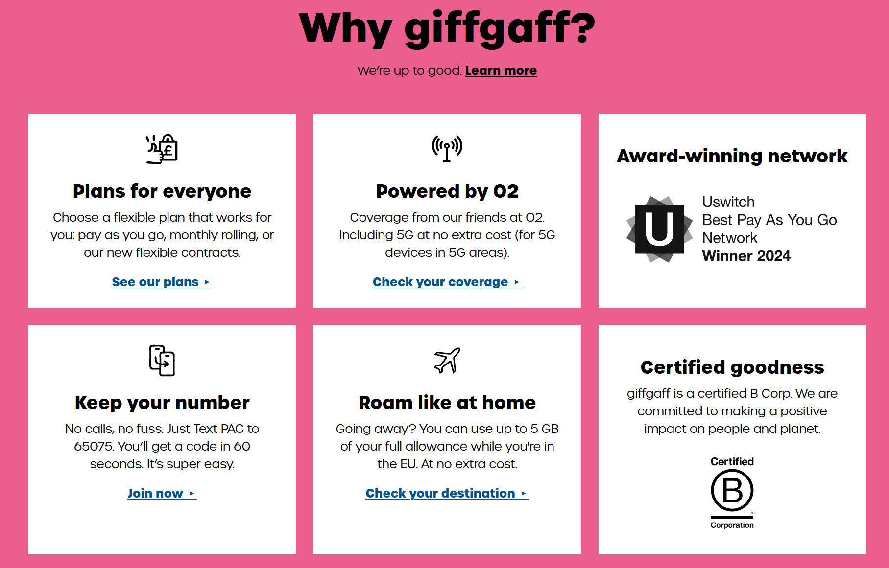
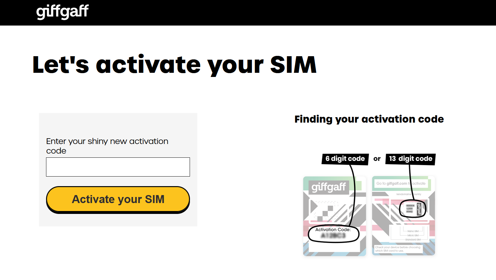
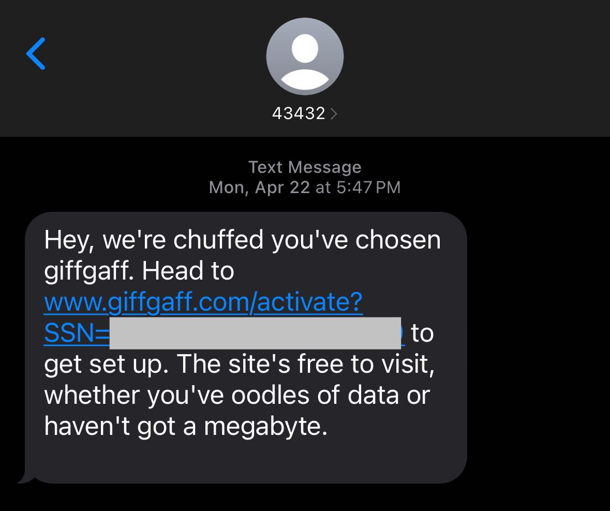
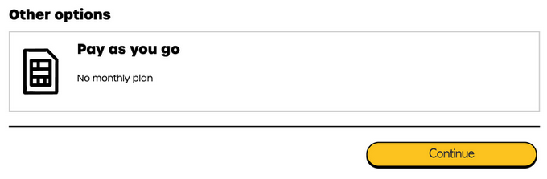

以非旅游、工作为目的注册外国的手机号的现象，恐怕也就只在中国会普遍存在了。现在，为了使用国外的 AI 服务，除了 "特殊" 的网络环境，手机号也成为中国用户的一大障碍；以及出于隐私保护等诸多原因，注册国外号码也逐渐成为不少 "硬核" 用户的刚需。

> [!TIP]
>
> 没有国际信用卡也可以使用，记得看下去 ;)

## 优势

- 支持直接邮寄至中国境内
- 可选择 "Pay as you go" 无月租 & 合约
- 可在中国免费接收短信，支持注册几乎各类支持英国地区的境外服务
- 在英国使用可享受 giffgaff 用户之间免费通话 & 短信



---

## 流程

### 申请 SIM 卡

前往 [giffgaff 官网](https://www.giffgaff.com/freesim-international) (无奖励) 或使用 [**邀请链接**](https://www.giffgaff.com/orders/affiliate/wroff774_1713786353517) (激活后可获得 £5 奖励) 进行注册。

在表单中填入 First name (名), Last name (姓), Email (邮箱地址), Country (国家), Postcode (邮编号码)，其余详细地址均需使用英文进行表达，大部分情况下使用道路的拼音写法即可。

如果不清楚该如何以英文形式表达自己的住址，你可以使用以下指令并发送给 ChatGPT:

```
请将我的中文地址转换为英文格式，包括为 Address Line , Town/City, Country/Province/State (Optional), Country 的字段。我的中文地址为...
```

由于 giffgaff 采用平邮的方式进行邮寄，因此等待时间可能较长。以本人为例，从申请到送达信箱总共间隔了 2 周；偏远地区则等待时间可能会更长。

<iframe src="https://fedist.me/@wr/112314175796443437/embed" class="mastodon-embed" style="max-width: 100%; border: 0" width="400" allowfullscreen="allowfullscreen"></iframe><script src="https://fedist.me/embed.js" async="async"></script>

如果不清楚自己地址填写是否正确的话，也可以多申请几份，反正申请不要钱 😉

### 激活

信封内包含一张 SIM 卡及其附带的激活编号

打开 [激活页面](https://www.giffgaff.com/activate)，输入卡上的 8 位编号或 SIM 卡背面的 13 位编号



除此之外，你也可以将 SIM 卡插入 SIM 插槽，稍等片刻即可收到内容类似于下图的短信。通过短信中的链接激活效果也是相同的



进入下一页面后将会需要注册 giffgaff 账户，使用一般邮箱地址即可。

来到套餐选择界面，请滚到页面底部 **Other options** 区域并选择 `Pay as you go - No monthly plan`



接下来会来到充值界面，首次充值要求最低 10 英镑；使用邀请链接进行注册的充值后则会获得额外 5 英镑奖励。

默认情况下，giffgaff 需要绑定 Visa / MasterCard 等外币卡；如果没有外币卡也可通过 "giffgaff 充值卡" 等关键词购买充值代码以进行激活。

---

## 资费

在中国大陆，giffgaff 连接<u>中国移动</u>与<u>中国联通</u>的基站以进行漫游通信。

_中国漫游资费如下:_

| 项目         | 价格 (GBP) | 价格 (RMB) |
| :----------- | ---------- | ---------- |
| 通话 (接/收) | £1/min     | ¥9/min     |
| 接收短信     | 免费       | 免费       |
| 发送短信     | £0.3/text  | ¥2.7/text  |
| 流量         | £0.2/MB    | ¥1.8/MB    |

> [!NOTE]
>
> 有意思的是，该运营商在英国可以与同为 giffgaff 的用户进行免费通话与短信，然而这一规则并不在漫游时生效。

另外，giffgaff 要求每半年进行至少一次余额变动 (增加/减少)，因此建议至少半年一次对任意英国号码发送一条短信。

---

## 在华使用体验

giffgaff 适合在支持双卡的设备中使用。在 iPhone 中，可将 giffgaff 设为副卡，并选择使用国内运营商的蜂窝网络数据 (建议同时将 `Allow Cellular Data Switching` 关闭)。

日常使用体验于国内手机卡无异，不过该运营商会自动为来自网络平台的短信进行归类命名，体验优于国内。

如果你是 iPhone 用户，建议在首次插入手机时关闭以该手机号作为 FaceTime / iMessage 号码，以避免相关服务验证手机号自动发送短信从而造成的额外资费。
