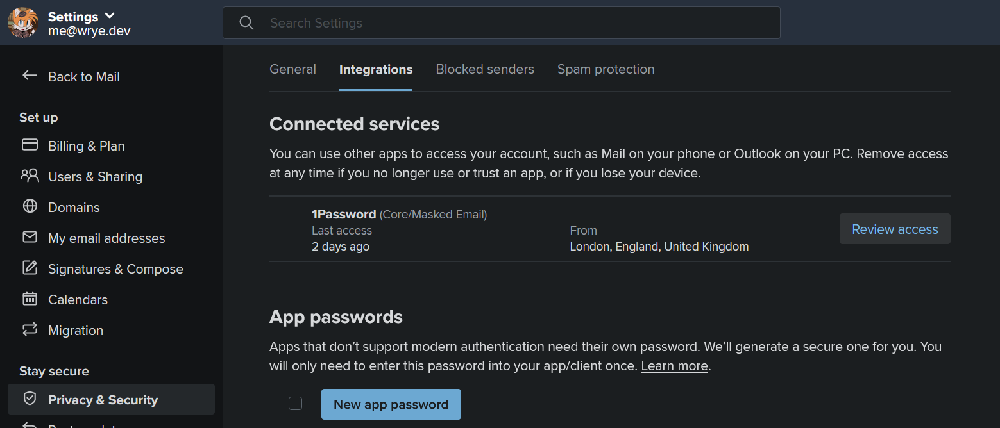
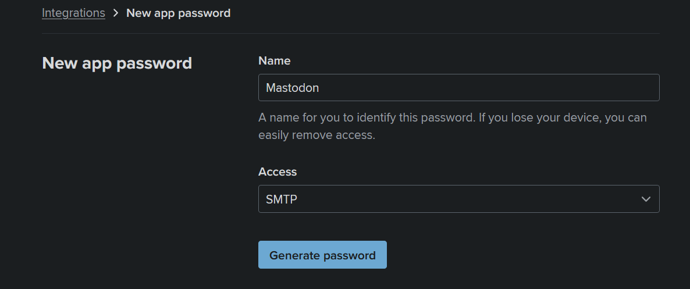

## Why Fastmail?

Recently, I've been maintaining my self-hosted Mastodon instance [fedist.me](https://fedist.me) on my own VPS. Most of the steps to deploy the Mastodon service were easy and straightforward. However, my attempt to deploy an SMTP service for my instance was not as easy.

Initially, I tried to use Mailgun as the SMTP service but later discovered that sending emails via Mailgun is no longer available for free, even for students. So, I gave up on that option. I also tried Gmail, which was the only other method I tried that managed to send emails successfully. However, most of the emails sent via Gmail ended up in the Spam folder. Therefore, I decided to look for a better service.

Now, you might wonder why I didn't choose to self-maintain an SMTP server. Well, that decision was mostly influenced by the "email domain reputation". Most emails sent from self-maintained email servers are considered as "spam." For more information, please check [this link](https://www.reddit.com/r/selfhosted/comments/t8gqir/why_you_really_dont_want_to_selfhost_your_own/).

The reason I chose Fastmail is mainly because of its integration with 1Password to create masked emails and its commitment to protecting user privacy. Besides, how could it be called "Fastmail" without being fast? lol

You can sign up Fastmail via my [invitation link](https://join.fastmail.com/8ddbc185), which could provide you a discount of 10% off for the first year and benefit both of us. Thanks! >\_<

## Adding an app password

The steps are quite straightforward. First, go to Fastmail `Settings > Privacy & Security > Integrations` and click on `New app password`.



After entering your password, you'll be redirected to the `New app password` page. Here, you can set the name and privileges for the app password.

For example, you can set the name as `Mastodon` and its access as `SMTP` only (recommended).



## Adding aliases / rules

To avoid mixing your daily email with emails sent from your Mastodon instances, it is recommended to add specific aliases and rules.

Due to privacy reasons, I cannot provide an example, so please figure it out by yourself. :3

## Editing Mastodon configuration

In this example, I'll be using a Mastodon instance hosted on Ubuntu without Docker.

Login to your server via SSH, switch to the `mastodon` account, and navigate to the Mastodon path `~/live`.

```shell
su - mastodon
cd live
```

Now, edit the production environment configuration file of Mastodon.

```shell
vim .env.production
```

Navigate to the SMTP section of the file and press `i` to enter edit mode. (If you don't have such configurations, just add it at the bottom of the file.)

Please remember to replace `YOUR_FASTMAIL_MAIN_ADDRESS`, `YOUR_APP_PASSWORD`, and `YOUR_ALIAS_ADDRESS` with your own credentials.

```shell
SMTP_SERVER=smtp.fastmail.com
SMTP_PORT=465
SMTP_SSL=true
SMTP_LOGIN=YOUR_FASTMAIL_MAIN_ADDRESS
SMTP_PASSWORD=YOUR_APP_PASSWORD
SMTP_AUTH_METHOD=plain
SMTP_OPENSSL_VERIFY_MODE=none
SMTP_ENABLE_STARTTLS_AUTO=false
SMTP_FROM_ADDRESS=Mastodon <YOUR_ALIAS_ADDRESS>
```

After editing, press `Esc`, then `Shift + ZZ` to save and exit.

## Restarting Mastodon services

```shell
sudo systemctl restart mastodon-sidekiq.service
sudo systemctl restart mastodon-streaming.service
sudo systemctl restart mastodon-web.service
```

And you're done! Feel free to go to the "reset email" or "forgot password" section to try out the new email service.
